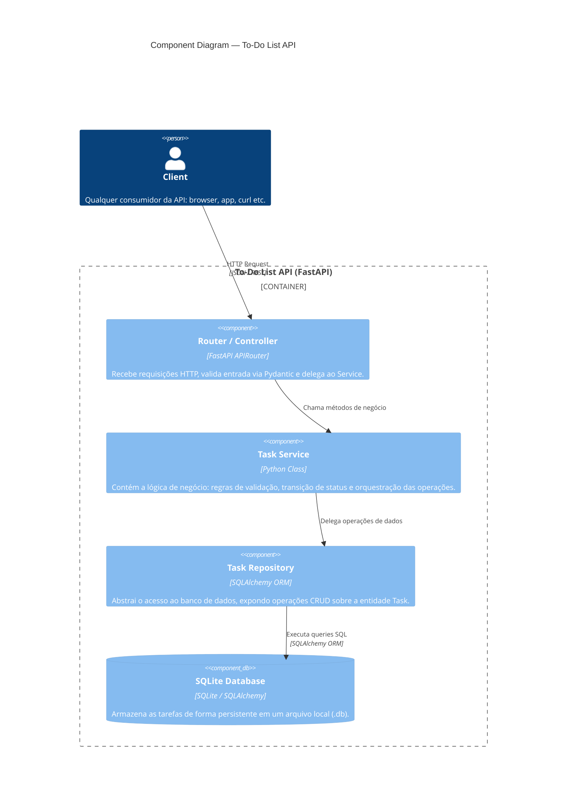

```mermaid
C4Component
    title Component Diagram — To-Do List API

    Person(client, "Client", "Qualquer consumidor da API: browser, app, curl etc.")

    Container_Boundary(api, "To-Do List API (FastAPI)") {

        Component(router, "Router / Controller", "FastAPI APIRouter", "Recebe requisições HTTP, valida entrada via Pydantic e delega ao Service.")

        Component(service, "Task Service", "Python Class", "Contém a lógica de negócio: regras de validação, transição de status e orquestração das operações.")

        Component(repository, "Task Repository", "SQLAlchemy ORM", "Abstrai o acesso ao banco de dados, expondo operações CRUD sobre a entidade Task.")

        ComponentDb(db, "SQLite Database", "SQLite / SQLAlchemy", "Armazena as tarefas de forma persistente em um arquivo local (.db).")
    }

    Rel(client, router, "HTTP Request", "JSON / REST")
    Rel(router, service, "Chama métodos de negócio")
    Rel(service, repository, "Delega operações de dados")
    Rel(repository, db, "Executa queries SQL", "SQLAlchemy ORM")

    UpdateLayoutConfig($c4ShapeInRow="3", $c4BoundaryInRow="1")
```
