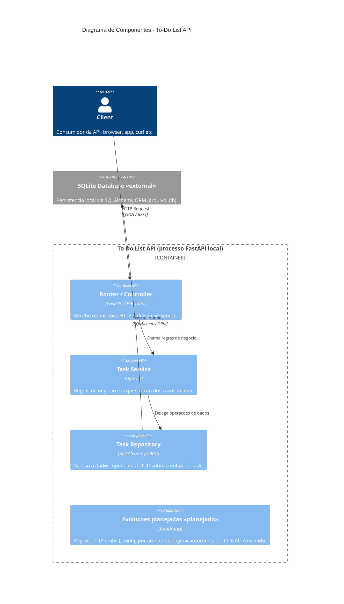

# Diagrama de Componentes (Diagram as Code) — To-Do List API

Diagrama estrutural no nível de **componentes** (C4 nível 3), gerado a partir do
roteiro aprovado em [`roteiro-diagrama-componentes.md`](./roteiro-diagrama-componentes.md).

> Renderização: o bloco abaixo usa **Mermaid C4**, que o GitHub e a maioria dos
> previews Markdown renderizam nativamente.

## Diagrama

## Legenda das decisões

- **Escopo:** apenas Router, Service, Repository e persistência (DB).
- **Camadas:** `Client -> Router -> Service -> Repository -> SQLite`.
- **Aresta `Router -> Repository`:** idealizada (ausente); o Router conhece apenas o Service.
- **Persistência:** sistema separado, fora da fronteira da API, marcado como «external».
- **Entidade Task:** única e implícita no Repository (sem separar ORM e Pydantic).
- **Evoluções planejadas:** sinalizadas como «planejado» / não concluídas.
- **Ocultos:** schemas Pydantic, camada `db` (engine/session), router de `health`, detalhes internos.
