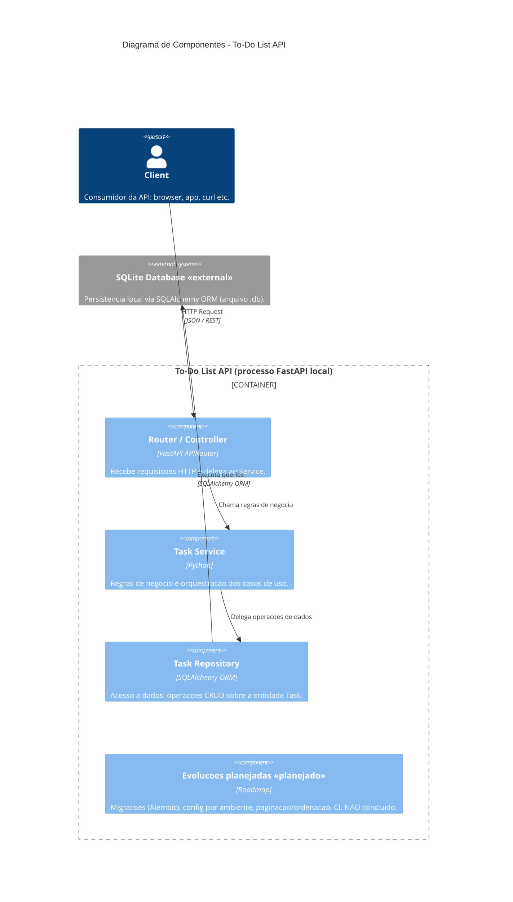

# Discovery de Documentação — Diagrams as Code

Atividade de praticar a abordagem *diagrams as code*, documentando um sistema real em
linguagem natural e derivando dele diagramas versionáveis (Mermaid/PlantUML), pensados
para servir de contexto a agentes de desenvolvimento no futuro.

## Sistema escolhido

**To-Do List API** — uma micro-API REST, escrita em Python 3.12, para gerenciamento de
tarefas (CRUD, filtragem e validação). Usa FastAPI, SQLAlchemy ORM, SQLite e Pydantic v2.
É o próprio sistema deste repositório, já implementado e documentado (escopo, requisitos,
riscos), o que permite confrontar o que a IA infere com o que o produto realmente faz.

## 1. Descrição em linguagem natural

### 1.1 Escopo

Expor operações CRUD sobre tarefas via HTTP/REST: criar, listar, buscar por ID, atualizar,
excluir, filtrar por ID e status (`pending`/`completed`) e um endpoint de health check.
A persistência é local, em arquivo SQLite via SQLAlchemy ORM. Não há autenticação,
interface gráfica, multi-tenant, paginação avançada nem integração com serviços externos.

O diagrama desta sessão foca no **nível de componentes** (C4 nível 3), refinando o
diagrama já existente em [`architecture.md`](./architecture.md).

### 1.2 Nível da visão

Documentação no nível **estrutural — componentes** (C4 nível 3), mostrando a organização
interna em camadas da API e a fronteira de execução, com a persistência como sistema
externo. (O nível comportamental não faz parte desta sessão.)

### 1.3 Limites e responsabilidades

| Componente | Responsabilidade |
|------------|------------------|
| Router / Controller (`app/api/task_routes.py`) | Camada HTTP: recebe requisições, valida entrada e delega ao Service. |
| Task Service (`app/services/task_service.py`) | Regras de negócio e orquestração dos casos de uso; lança `TaskNotFoundError`. |
| Task Repository (`app/repositories/task_repository.py`) | Acesso a dados via SQLAlchemy; operações CRUD sobre a entidade `Task`. |
| Persistência SQLite (`app/db/todolist.db`) | Armazenamento local via SQLAlchemy ORM; representado como sistema externo. |

### 1.4 Integrações

Nenhuma integração externa de terceiros. A única dependência externa relevante é o banco
**SQLite** local (via SQLAlchemy ORM), modelado como sistema separado fora da fronteira da
API. Sem rede, sem auth, sem serviços de terceiros, sem multi-tenant. A "interface" é o
protocolo HTTP/REST consumido pelo Client.

### 1.5 Restrições

- **Camadas:** fluxo estrito `Client -> Router -> Service -> Repository -> SQLite`; cada
  camada só conhece a imediatamente inferior.
- **Aresta `Router -> Repository`:** representada de forma **idealizada** (ausente) — o
  Router conhece apenas o Service.
- **Entidade `Task`:** representada de forma única (sem separar ORM de Pydantic).
- **Notação:** C4 no nível de componentes (PlantUML e Mermaid C4).

### 1.6 Lacunas conhecidas (herdadas da análise de riscos)

Documentadas em `riscos/` e mantidas explícitas de propósito:

- Configuração de banco dependente de caminho fixo no código (`sqlite:///./app/db/todolist.db`).
- Ausência de migração versionada de schema (Alembic planejado, não concluído).
- Campo `status` sem restrição no nível do banco.
- Listagem sem paginação (risco de degradação com o crescimento de volume).
- `PATCH`/atualização com payload vazio aceito silenciosamente.

## 2. Diagrama estrutural — Visão de componentes (C4 nível 3)

Fonte versionada: [`diagram-as-code.md`](./diagram-as-code.md) (Mermaid C4).

## 3. Processo desta sessão (roteiro → diagrama)

O trabalho seguiu a disciplina de *diagrams as code*: primeiro alinhamos um **roteiro**
antes de qualquer diagrama, resolvendo lacunas por perguntas objetivas; depois geramos o
código do diagrama; por fim confrontamos com o código real do repositório.

1. **Levantamento de lacunas e perguntas** — identificação de ambiguidades (nível, escopo,
   dependências, notação) antes de desenhar qualquer coisa.
2. **Roteiro revisado e aprovado** — registrado em
   [`roteiro-diagrama-componentes.md`](./roteiro-diagrama-componentes.md), estruturado nos
   elementos Escopo, Nível, Limites, Integrações, Restrições e Lacunas.
3. **Geração do diagrama** — inicialmente em C4-PlantUML e, em seguida, convertido para
   **Mermaid C4** ([`diagram-as-code.md`](./diagram-as-code.md)) para renderização nativa no GitHub.

## 4. Decisões e ajustes sobre o que o modelo gerou

O fluxo confrontou o esqueleto proposto pela IA com o código real em `app/` antes de
versionar.

### 4.1 O que o modelo inferiu corretamente

- A separação em três camadas (Router, Service, Repository) e o papel de cada uma —
  confirmado em `task_routes.py`, `task_service.py` e `task_repository.py`.
- O fluxo em camadas `Router -> Service -> Repository -> SQLite`, coerente com o diagrama
  existente em `architecture.md`.
- O uso de SQLAlchemy ORM sobre SQLite como mecanismo único de persistência.

### 4.2 O que precisei ajustar (decisões minhas)

- **Aresta `Router -> Repository`.** No código real, `get_task_service` em `task_routes.py`
  instancia `TaskRepository` diretamente, ou seja, o Router conhece o Repository na montagem
  da dependência. Optei pela representação **idealizada (b)**: o diagrama mostra o Router
  falando apenas com o Service, para não induzir um agente a reforçar esse acoplamento.
  A divergência ficou registrada no roteiro como decisão consciente.
- **Persistência como sistema externo.** Movi o SQLite para fora da fronteira da API
  (era `ComponentDb` interno no diagrama antigo), marcando-o como «external», para deixar
  claro o limite de responsabilidade da aplicação.
- **Entidade Task única.** O código tem duas representações (`Task` ORM e schemas Pydantic).
  Decidi representá-la de forma única e implícita no Repository, evitando poluir o nível de
  componentes com contratos de I/O.
- **Elementos ocultos.** Removi do diagrama os schemas Pydantic, a camada `db`
  (engine/session/`get_db`) e o router de `health`, por não fazerem parte do escopo definido.

### 4.3 O que a documentação ainda precisaria para um agente construir sem inventar decisões

- **Estratégia de migrações** (Alembic): hoje o schema é criado via `create_all`; um agente
  precisa saber que migrações versionadas são planejadas, não existentes.
- **Configuração por ambiente:** o caminho do banco está fixo no código; falta declarar como
  contrato o mecanismo de configuração pretendido.
- **Restrição de `status` no banco:** a coluna é `String` livre; a restrição de domínio vive
  só na aplicação (enum Pydantic). Convém explicitar se deve virar constraint.
- **Contrato de atualização com payload vazio:** o comportamento atual (aceitar silenciosamente)
  precisa ser declarado como intencional ou tratado como bug.

Por isso essas lacunas permanecem registradas de forma explícita no repositório
(`riscos/` e no roteiro), em vez de escondidas: é a diferença entre uma suposição plausível
da IA e uma decisão validada.
